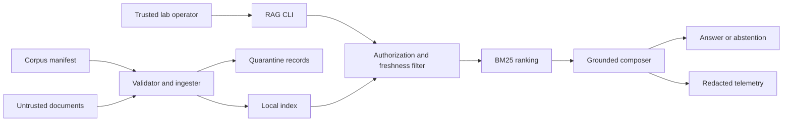

# Secure Offline RAG Reference Threat Model

## Executive summary

The highest risks are cross-tenant retrieval, poisoned content becoming instruction, stale evidence being presented as current, and sensitive text entering logs. The reference reduces these risks by treating manifest metadata as policy, filtering before ranking, quarantining before indexing, answering only from cited text, and emitting content-free telemetry. It is a local teaching CLI, not an authenticated production service.

## Scope and assumptions

- In scope: `rag.py`, `corpus/manifest.json`, synthetic documents, eval cases, schemas, generated local index, and JSONL telemetry.
- Runtime assumption: a trusted learner runs the CLI locally against checked-in synthetic data; there is no listener or concurrent multi-user service.
- Identity assumption: CLI `principal`, `tenant`, `roles`, and `clearances` are supplied by the trusted lab harness. In production they must come from verified identity claims, never user/model text.
- Out of scope: model-provider execution, embedding privacy, network transport, identity-provider compromise, production availability, CI publishing, and the optional hosted adapter.
- Material production questions: Who asserts tenant/roles? Is the service multi-tenant or internet-facing? What regulated data, retention, and deletion duties apply? Those answers can raise identity, privacy, and availability risks to critical.

## System model

### Primary components

- Manifest validator and ingester: validates metadata/path bounds, hashes sources, scans for poisoning, and builds the index (`rag.py:build_index`).
- Policy filter and retriever: evaluates tenant, role, explicit classification clearance, effective date, expiry, and quarantine before BM25-style scoring (`rag.py:_eligible_documents`, `rag.py:_bm25_score`).
- Grounded composer: selects a sentence from the best authorized chunk or abstains (`rag.py:answer_query`).
- Evaluator and telemetry sink: checks quality/security cases and appends redacted events (`rag.py:evaluate`, `rag.py:_telemetry_event`).

### Data flows and trust boundaries

- Operator → CLI: arguments over the local process boundary; bounded query length and result count, but no authentication.
- Manifest → ingester: paths and policy metadata from a developer-controlled file; schema-like validation, path containment, suffix and size limits.
- Documents → quarantine/index: untrusted text from allowlisted files; content hash evidence and poison scan before chunking.
- Principal context → policy filter: identity attributes from the lab harness; exact tenant/role/classification/date comparison before ranking.
- Authorized chunks → composer: synthetic text; extractive sentence selection with stable citation, no instruction execution or tools.
- Decision → telemetry: version/integrity hashes, source IDs, counts and outcomes only; content and deterministic principal/tenant/query hashes are excluded and tested.

#### Diagram

## Assets and security objectives

| Asset | Why it matters | Security objective |
|---|---|---|
| Tenant-scoped documents | Cross-tenant disclosure causes confidentiality harm | C |
| Source text and metadata | Poisoning or stale policy corrupts answers | I |
| Principal attributes | They determine retrieval authority | I |
| Index and corpus versions | They make results reproducible and revocable | I/A |
| Citations | They support audit and answer verification | I |
| Telemetry | It aids response but can become a data leak | C/I/A |

## Attacker model

### Capabilities

- Submit or influence a source document before ingestion.
- Ask arbitrary questions and try to infer inaccessible sources.
- Supply long or adversarial text to exhaust ranking or trigger instruction-like content.
- Modify local files if the lab host account is already compromised.

### Non-capabilities

- No remote endpoint, model tool execution, secret store, or production identity provider exists in this fixture.
- A question cannot change manifest ACLs, quarantine decisions, or filesystem paths.
- The reference does not execute retrieved text, code, links, or commands.

## Entry points and attack surfaces

| Surface | How reached | Trust boundary | Notes | Evidence |
|---|---|---|---|---|
| Manifest | `ingest --manifest` | File → ingester | Controls paths and ACL metadata | `rag.py:_validate_manifest` |
| Source file | Manifest path | Document → quarantine | Text may contain injection | `rag.py:_resolve_source`, `_quarantine_reasons` |
| Question | `query --question` | Operator → retriever | Bounded token count | `rag.py:answer_query` |
| Principal claims | CLI identity arguments | Harness → policy | Trusted only in this lab | `rag.py:_eligible_documents` |
| Index | `query --index` | File → runtime | Schema/version checked; not signed | `rag.py:load_index` |
| Telemetry path | `--telemetry` | Runtime → file | Caller chooses local destination | `rag.py:_append_telemetry` |

## Top abuse paths

1. Attacker adds an instruction-bearing document → ingestion detects a poison pattern or manifest quarantine → document is recorded but not chunked → no answer can cite it.
2. Northstar user asks for a Southstar codename → tenant filter removes the document before scoring → request abstains without revealing source existence.
3. User asks for expired policy → date filter removes stale evidence → request abstains.
4. User supplies an oversized query → budget gate blocks before retrieval → bounded resource use.
5. Operator points a manifest outside the corpus → resolved-path containment rejects ingestion → no arbitrary file read.
6. Analyst inspects telemetry → sees trace and source IDs but not prompts/chunks/answers → reduced log disclosure.

## Threat model table

| Threat ID | Threat source | Prerequisites | Threat action | Impact | Impacted assets | Existing controls (evidence) | Gaps | Recommended mitigations | Detection ideas | Likelihood | Impact severity | Priority |
|---|---|---|---|---|---|---|---|---|---|---|---|---|
| TM-001 | Malicious corpus contributor | Can place a file in an approved ingestion path | Embeds instructions that try to override the agent or exfiltrate data | Chained tool abuse or disclosure in a production adapter | Documents, answers, downstream systems | Scanner-derived pre-index quarantine with named reasons (`rag.py:_quarantine_reasons`, eval `RAG-E05`) | Pattern detection is incomplete | Require source ownership/signature, isolated scanning, human admission, output/tool policy independent of model | Quarantine reason drift; source-to-denial correlation | Medium | High | High |
| TM-002 | Cross-tenant or under-cleared questioner | Can query a shared service | Uses distinctive terms to retrieve another tenant's or higher-classification document | Confidential data disclosure | Tenant/restricted documents | Filter-before-rank (`rag.py:_eligible_documents`); caller sees no per-reason filter counts; adversarial evals `RAG-E03` and `RAG-E04` | CLI claims are not authenticated | Bind tenant/roles/clearances to verified workload/user identity and object authorization; use separate stores for highest sensitivity | Protected operator-only denied tenant/classification counts, canary source access | Medium | High | High |
| TM-003 | Corpus maintainer or stale/deletion pipeline | Can leave expired or deletion-pending content indexed | Causes obsolete/deleted policy to rank | Integrity, privacy, and business-decision harm | Answers, citations | Effective/expiry filter plus omission of deletion-pending chunks; evals `RAG-E06`/`E07` | No automatic owner revalidation | Enforce owner attestations, freshness SLO, deletion and reindex workflow; `legal_hold` preserves data but confers no authorization, while otherwise-authorized callers may retrieve it | Stale/deletion-source count and last-successful-ingestion age | Medium | Medium | Medium |
| TM-004 | Local user | Can alter index JSON after build | Changes chunks or ACL-linked metadata | Unauthorized or false answers | Index, answers | Corpus/index version recorded; source hashes recorded | Index itself is not signed | Store index read-only, sign release artifact, rebuild rather than edit | Verify signature/version at startup | Low | High | Medium |
| TM-005 | Query user | Can send costly or irrelevant input | Exhausts CPU or floods telemetry | Availability/cost loss | Runtime, telemetry | Query/result/chunk budgets (`rag.py:answer_query`) | No rate limiter in CLI | Add authenticated quotas, concurrency limits, timeouts and backpressure in a service | Budget denials, p95 latency, per-principal rate | Medium | Medium | Medium |
| TM-006 | Operator or log consumer | Can configure/read telemetry | Captures prompts, identity probes, or retrieved sensitive content | Secondary data breach | Documents, questions, identities, logs | Content-free event builder and test (`rag.py:_telemetry_event`); no unsalted principal/tenant/query hashes | Source IDs and counts may still be sensitive | Classify/redact metadata, restrict access, encrypt and expire logs; use vault-backed keyed HMAC or approved opaque IDs only when identity correlation is required | Schema rejection for content/identity-hash fields; access audit | Low | High | Medium |

## Criticality calibration

- Critical: verified identity bypass plus cross-tenant restricted-data retrieval; remote code/tool execution from poisoned content.
- High: repeatable cross-tenant disclosure, credential leakage, or corpus/index integrity compromise affecting consequential decisions.
- Medium: bounded denial of service, stale-policy answer, or sensitive metadata leakage with required local access.
- Low: synthetic-data disclosure or noisy malformed input with no security-boundary effect.

The index `integrity_sha256` is recomputed over policy metadata, chunks, and retrieval statistics on load. It detects modification after build but does not prove who published the corpus/index; production admission must bind that digest to an authenticated signed release and trusted owner.

## Focus paths for security review

| Path | Why it matters | Related Threat IDs |
|---|---|---|
| `rag.py` | All validation, filtering, ranking, composition and logging controls | TM-001–TM-006 |
| `corpus/manifest.json` | Source admission, ACL and freshness policy | TM-001–TM-004 |
| `evals/cases.json` | Regression gates for answerability and abuse cases | TM-001–TM-003, TM-005 |
| `OPENAI_FILE_SEARCH_ADAPTER.md` | Adds credentials, network, hosted storage and model behavior | TM-001, TM-002, TM-005, TM-006 |
| `../module-08/rag-mcp-bridge` | Adds a protocol and tool boundary | TM-001, TM-002, TM-005 |

## Quality check

- Covered the CLI, manifest, document, index, identity-claim and telemetry entry points.
- Represented every discovered trust boundary in at least one abuse path.
- Kept runtime behavior separate from tests and the optional hosted adapter.
- Stated that production identity, exposure, sensitivity, retention and scale remain open.
